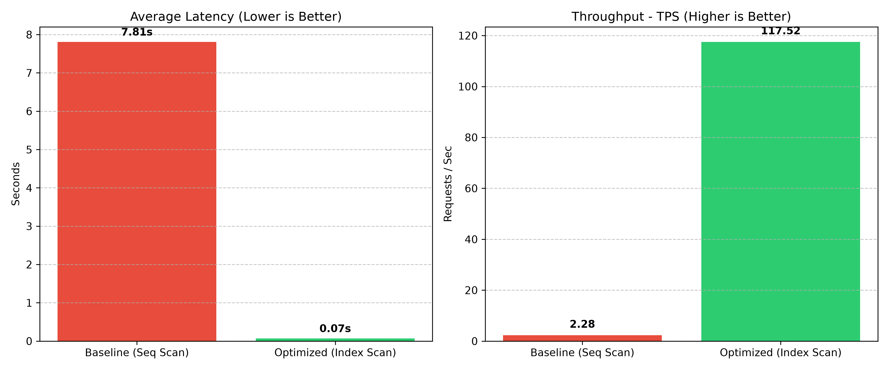

# PostgreSQL 巨量資料壓力測試與效能優化

使用 Docker + PostgreSQL，
針對 1,270 萬筆紐約計程車資料進行匯入、併發壓力測試、索引優化與零停機資料遷移實驗。

## 環境
- Docker + PostgreSQL 16
- Python 3.14.6 (psycopg2, pandas, matplotlib)

## 實驗步驟與結果

### 1. 巨量資料匯入
使用原生 `COPY` 語法，22.83 秒內匯入 1,270 萬筆資料。

### 2. 基準線壓力測試
基準測試（20 個使用者同時使用，未優化）：
- 平均延遲：7.81 秒
- TPS：2.28

### 3. Schema 修復與索引優化
- 修正動態轉型欄位為原生 INTEGER / NUMERIC
- 建立高選擇性 B-Tree 複合索引
- ANALYZE 更新統計資訊

### 4. 優化後效能
優化前後比較：
- 平均延遲：7.81 秒 → 0.07 秒（快了約 111 倍）
- TPS：2.28 → 117.52（提升約 51 倍）

### 5. 批次資料遷移
分批 10 萬筆，4.38 秒完成 100 萬筆遷移，吞吐量 228,548 rows/sec。

## 重現
\`\`\`bash
docker run --name pg-stress-test -e POSTGRES_PASSWORD=xxx -p 5432:5432 -d postgres:16
pip install -r requirements.txt
python scripts/01_import_data.py
\`\`\`