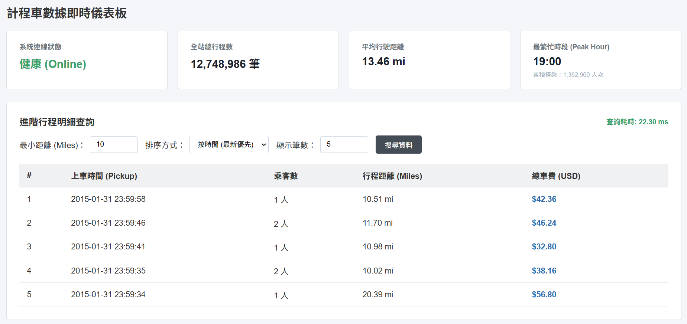

# NYC Taxi 資料庫效能優化與 API 服務

這個專案一開始是想練習 PostgreSQL 的資料庫壓力測試，後來在測試過程中陸續遇到查詢效能、資料遷移、API 連線建立和前端查詢速度等問題，所以一路加東西，最後變成一個小型的完整專案：

**資料匯入 → 資料庫效能優化 → API 開發 → Connection Pool → 前端儀表板**

整個專案主要的做法是先測試，再找瓶頸，修改後重新測試，比較優化前後的結果。

---
## 專案成果



本專案使用約 **1,270 萬筆 NYC Taxi 資料**進行測試。

| 項目        |        優化前 |       優化後 |          結果 |
| --------- | ---------: | --------: | ----------: |
| 資料庫平均查詢延遲 |     7.81 秒 |    0.07 秒 | 約 **111 倍** |
| 資料庫 TPS   |       2.28 |    117.52 |  約 **51 倍** |
| API 總執行時間 |   334.22 秒 |    1.09 秒 | 約 **306 倍** |
| API 成功請求  |  180 / 200 | 200 / 200 |   **0 筆失敗** |
| API RPS   |       0.60 |    183.74 | 約 **306 倍** |
| 進階行程查詢    | 3585.30 ms |  59.50 ms |  約 **60 倍** |

> 實際結果會受到硬體、Docker 設定、資料庫設定和測試環境影響。

---

## 使用技術

### 資料庫

* PostgreSQL 16
* Docker
* B-Tree Index
* `EXPLAIN ANALYZE`
* `ANALYZE`
* `COPY`

### 後端

* Python 3.14.6
* FastAPI
* Uvicorn
* psycopg2
* `ThreadedConnectionPool`

### 測試

* pytest
* Python 壓力測試腳本

### 前端

* HTML5
* CSS3
* JavaScript
* Fetch API

### 視覺化

* Matplotlib

---

# 1. 資料匯入

使用 NYC Taxi 資料集作為測試資料，共匯入：

**12,748,986 筆資料**

資料匯入使用 PostgreSQL 原生的 `COPY`，而不是逐筆執行 `INSERT`。

這次匯入總共花費：**22.83 秒**


---

# 2. 建立資料庫基準

資料匯入完成後，先不建立索引，也不做其他優化，直接進行第一次壓力測試。

測試條件：

* 同時使用者：20
* 進行大量查詢
* PostgreSQL 直接處理查詢

第一次測試結果：

* 平均延遲：**7.81 秒**
* TPS：**2.28**

這個結果明顯偏慢，所以接著使用 `EXPLAIN ANALYZE` 查看實際的查詢執行計畫。

---

# 3. 找出資料庫問題

透過 `EXPLAIN ANALYZE` 檢查後，主要發現兩個問題。

### 3.1 欄位型態不適合

部分欄位的資料型態和實際用途不太適合，查詢時需要額外進行型態轉換。

因此將相關欄位調整成適合查詢的型態，例如：

* `INTEGER`
* `NUMERIC`

減少查詢時不必要的型態轉換。

### 3.2 缺少索引

部分經常出現在查詢條件中的欄位沒有建立索引。

在沒有索引的情況下，PostgreSQL 會使用：

```text
Seq Scan
```

也就是逐筆掃描整張資料表。

因此針對常用的查詢欄位建立 B-Tree Index。

建立索引後，再執行：

```sql
ANALYZE;
```

讓 PostgreSQL 更新資料表的統計資訊，讓它可以更準確地選擇查詢方式。

---

# 4. 資料庫優化結果

完成欄位型態和索引調整後，再進行一次相同的測試。

| 項目     |    優化前 |    優化後 |
| ------ | -----: | -----: |
| 平均查詢延遲 | 7.81 秒 | 0.07 秒 |
| TPS    |   2.28 | 117.52 |


結果：

* 平均延遲降低約 **111 倍**
* TPS 提升約 **51 倍**

再次使用 `EXPLAIN ANALYZE` 檢查後，也確認部分查詢從：

```text
Seq Scan
```

變成：

```text
Index Scan
```

這次測試讓我比較直接地看到，當資料量來到一千多萬筆時，索引對查詢速度的影響非常明顯。

---

# 5. 批次資料遷移

除了查詢效能之外，也另外做了一次批次資料遷移實驗。

這次不是單純追求最快速度，而是想模擬比較接近實際環境的資料處理方式，例如：

* 不一次處理整張資料表
* 避免單次處理太多資料
* 控制記憶體使用量
* 降低長時間處理造成的影響

每批處理 10 萬筆，測試 100 萬筆資料後：

* 總資料量：**1,000,000 筆**
* 完成時間：**4.38 秒**
* 吞吐量：約 **228,548 rows/sec**

---

# 6. FastAPI API

完成資料庫測試後，進一步使用 FastAPI 將資料庫包裝成 API。

目前有三個主要端點：

| 方法  | 路徑                 | 功能            |
| --- | ------------------ | ------------- |
| GET | `/`                | 確認 API 是否正常運作 |
| GET | `/trips`           | 查詢計程車行程       |
| GET | `/stats/analytics` | 查詢統計資料(如總行程數、平均行駛距離、最繁忙時段) |

另外設定 CORS，讓前端可以直接透過 Fetch API 呼叫後端。

API 也使用 pytest 撰寫基本測試，目前三個主要 API 測試皆通過。

---

# 7. API 壓力測試：遇到新的問題

資料庫本身優化完成後，再把同樣的測試方式延伸到 API。

測試條件：

* 同時使用者：20
* 總請求數：200

第一次測試時，每次請求都重新建立 PostgreSQL 連線。

結果非常差：

* 總執行時間：**334.22 秒**
* 成功請求：**180 / 200**
* 失敗請求：**20**
* RPS：**0.60**
* 平均延遲：**33,415 ms**

原本以為資料庫查詢已經優化完成，API 應該也會很快，但實際測試後發現新的瓶頸。

問題不是 SQL 本身，而是：

**每一個 API 請求都重新建立資料庫連線。**

20 個使用者同時送出請求時，就會同時建立大量新的資料庫連線，導致資料庫需要花很多時間處理連線建立，有些請求最後直接逾時失敗。

---

# 8. 使用 Connection Pool

為了解決每次請求都建立新連線的問題，改用：

```python
psycopg2.pool.ThreadedConnectionPool
```

API 啟動時先建立一批資料庫連線。

每次請求進來：

1. 從連線池取得現有連線
2. 執行 SQL
3. 完成後把連線放回連線池

這樣就不用每次請求都重新建立 PostgreSQL 連線。

### 優化結果

| 項目    |       優化前 |       優化後 |
| ----- | --------: | --------: |
| 總執行時間 |  334.22 秒 |    1.09 秒 |
| 成功請求  | 180 / 200 | 200 / 200 |
| 失敗請求  |        20 |         0 |
| RPS   |      0.60 |    183.74 |
| 平均延遲  | 33,415 ms |  98.31 ms |

總執行時間從 **334.22 秒降低到 1.09 秒**。

除了速度提升之外，200 個請求也全部成功。

這次測試讓我發現，SQL 本身查得快，並不代表整個 API 就一定快。資料庫連線的建立與管理，同樣可能成為後端服務的瓶頸。

---

# 9. 前端儀表板

最後使用原生 HTML、CSS 和 JavaScript 做了一個簡單的前端儀表板，透過 Fetch API 呼叫 FastAPI。

目前包含：

* API 連線狀態
* 總行程數
* 平均行駛距離
* 最繁忙時段
* 行程明細表
* 距離篩選
* 排序
* 回傳筆數限制

前端主要目的是把前面建立的 API 實際使用起來，也方便觀察資料查詢結果。

---

# 10. 優化進階行程查詢

前端實際使用後，又發現一個新的問題。

「進階行程明細查詢」第一次測試需要：

**3585.30 ms**

再次檢查查詢後，發現 `tpep_pickup_datetime` 經常被拿來排序，但當時沒有建立適合這個查詢的索引。

另外，`trip_distance` 也經常出現在這類查詢中。

因此針對這兩個欄位建立複合索引。

優化後：

**3585.30 ms → 59.50 ms**

查詢時間降低約 **60 倍**。

---

# 11. 整體流程

整個專案最後的資料流很簡單：

**前端（HTML / JavaScript） → FastAPI → Connection Pool → PostgreSQL**

其中每一層都是在實際測試後逐步加入：

* 一開始先直接測 PostgreSQL
* 發現查詢太慢 → 加索引、調整欄位
* 資料庫優化後 → 加入 FastAPI
* API 壓力測試發現連線建立太慢 → 加 Connection Pool
* 前端使用後發現排序查詢太慢 → 加複合索引

所以這個專案並不是一開始就把所有東西都規劃好，而是測試過程中發現問題，再一個一個處理。

---

# 12. 專案結構

```text
SQL-stress-test-project/
├── API/
│   ├── __init__.py
│   ├── main.py
│   └── test_main.py
│
├── scripts/
│   ├── 01_import_data.py
│   ├── 02_benchmark_baseline.py
│   ├── 03_optimize_schema.py
│   ├── 04_benchmark_optimized.py
│   ├── 05_visualize.py
│   ├── 06_data_migration.py
│   └── stress_test.py
│
├── results/
│   └── dashboard.png
│   └── performance_comparison.png
│
├── build_index.py
├── index.html
├── requirements.txt
└── README.md
```

---

# 13. 如何執行

### 1. 啟動 PostgreSQL

```bash
docker run \
  --name pg-stress-test \
  -e POSTGRES_PASSWORD=xxx \
  -p 5432:5432 \
  -d postgres:16
```

### 2. 安裝套件

```bash
pip install -r requirements.txt
```

### 3. 匯入資料

```bash
python scripts/01_import_data.py
```

### 4. 啟動 API

```bash
python -m uvicorn API.main:app --reload
```

### 5. 開啟 API 文件

```text
http://localhost:8000/docs
```

### 6. 開啟前端

直接開啟：

```text
index.html
```

---

# 14. 測試

使用 pytest 測試主要 API：

```bash
python -m pytest
```

目前三個主要 API 測試皆通過。

另外使用 Python 撰寫壓力測試程式，模擬多個使用者同時發送 API 請求，測試 API 在併發情況下的：

* 回應時間
* 每秒請求數
* 成功與失敗數量
* 總執行時間

---

# 15. 目前成果

這個專案最後完成了從資料庫、後端 API 到前端的完整流程。

主要成果：

* 匯入 **12,748,986 筆** NYC Taxi 資料
* 使用 PostgreSQL `COPY` 進行大量資料匯入
* 使用 `EXPLAIN ANALYZE` 找出查詢問題
* 調整欄位型態與建立索引
* 資料庫平均延遲從 **7.81 秒降低到 0.07 秒**
* TPS 從 **2.28 提升到 117.52**
* 完成 100 萬筆資料的批次遷移實驗
* 使用 FastAPI 建立資料查詢 API
* 使用 `ThreadedConnectionPool` 改善資料庫連線管理
* API RPS 從 **0.60 提升到 183.74**
* API 失敗請求從 **20 / 200 降到 0**
* 前端進階查詢從 **3585.30 ms 降到 59.50 ms**
* 建立可以直接操作 API 的前端儀表板
